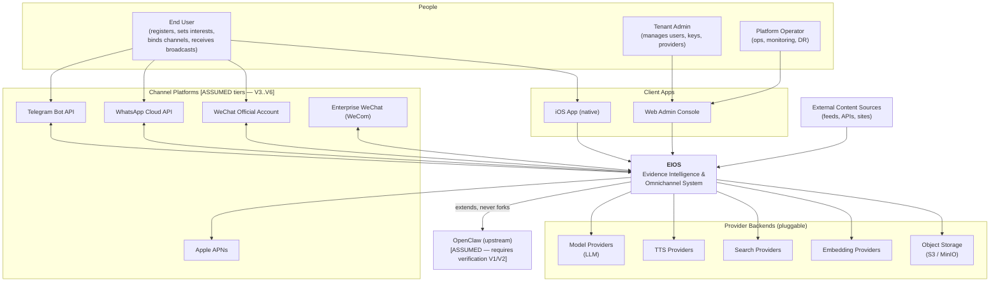
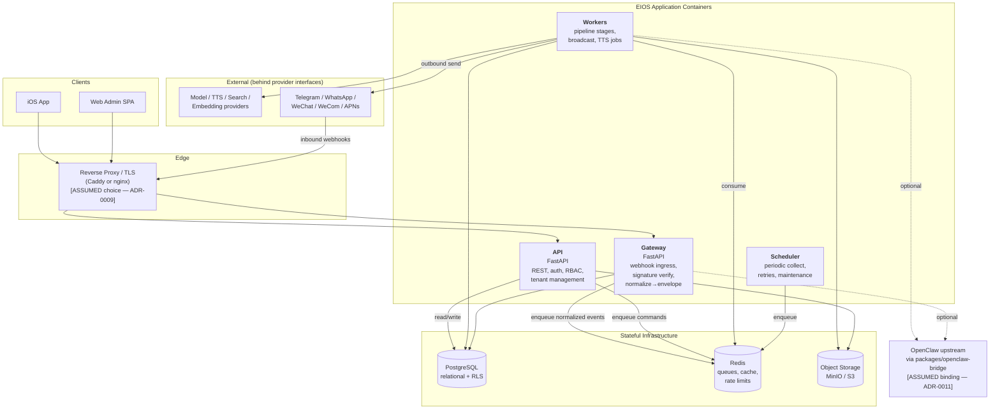

# 00 — System Context & Container Diagrams

Deliverables **1 (System Context)** and **2 (Container)**. Notation: C4 model,
levels 1 and 2. Diagrams are Mermaid so they render on GitHub.

---

## 1. System Context (C4 Level 1)

**Purpose:** show EIOS as a single system, its human roles, and the external
systems it depends on. **[VERIFIED]** as design intent; external systems marked
where their availability is **[ASSUMED — requires verification]** (see
[open items V1–V8](./README.md#open-verification-items)).

### Actors and external systems

| Element | Type | Notes |
|---------|------|-------|
| End User | person | Thousands expected; each fully isolated. **[VERIFIED]** requirement. |
| Tenant Admin | person | Manages a tenant's users/keys/providers. **[ASSUMED]** role split. |
| Platform Operator | person | Runs the VPS, monitoring, backups. **[ASSUMED]** |
| iOS App | external client | Native, APNs-enabled. **[VERIFIED]** target. |
| Web Admin | external client | Browser SPA. **[ASSUMED]** — implied by "Web Admin" in the client list. |
| Telegram / WhatsApp / WeChat / WeCom | bidirectional channels | Inbound + outbound. **[ASSUMED tiers]** |
| APNs | outbound only | Push to iOS. **[VERIFIED]** direction. |
| Provider backends | pluggable deps | Behind provider interfaces. **[VERIFIED]** design. |
| OpenClaw | upstream dependency | **[ASSUMED — requires verification]** |
| External content sources | data input | Feed the Collect stage. **[ASSUMED]** shape. |

---

## 2. Container Diagram (C4 Level 2)

**Purpose:** the deployable/runtime units inside EIOS and how they talk. All
run on a single Ubuntu VPS via Docker Compose at launch
([deployment topology](./09-deployment-and-scaling.md)). **[VERIFIED]** as the
target from the mission brief.

### Containers

| Container | Tech **[VERIFIED target]** | Responsibility | State |
|-----------|------|----------------|-------|
| **Gateway** | FastAPI (Python) | Terminate inbound channel webhooks, verify signatures/timestamps, normalize to the internal envelope, enqueue. **No business logic.** | stateless |
| **API** | FastAPI (Python) | REST surface for clients: auth, RBAC, tenant/user/device/interest/key management, history reads. | stateless |
| **Workers** | Python worker processes | Execute pipeline stages, provider calls, TTS synthesis, broadcast fan-out. Horizontally scalable per queue. | stateless |
| **Scheduler** | Python (e.g. beat-style) | Enqueue periodic Collect jobs, retries, housekeeping. Single-leader. | stateless (leader-elected) |
| **PostgreSQL** | Postgres 16 | System of record; tenant isolation via RLS. | **stateful** |
| **Redis** | Redis 7 | Work queues, caching, rate-limit counters, ephemeral locks. | **stateful (ephemeral-tolerant)** |
| **Object Storage** | MinIO (S3-compatible) | Evidence artifacts, generated audio, media. | **stateful** |
| **Reverse Proxy** | Caddy or nginx **[ASSUMED — ADR-0009]** | TLS termination, routing, basic WAF/rate-limit at edge. | stateless |

**[ASSUMED]** Gateway and API are separate containers (not one FastAPI app) so
that inbound channel traffic cannot exhaust the authenticated API surface and
each scales independently. Revisit if VPS is very small (see
[scaling roadmap](./09-deployment-and-scaling.md)).

### Why FastAPI, Postgres, Redis, MinIO

**[VERIFIED]** — these are named directly in the mission's deployment target
(Ubuntu VPS, Docker Compose, FastAPI, PostgreSQL, Redis, Object Storage,
Gateway, Workers). This blueprint adopts them rather than proposing
alternatives.

Note the **stack shift from Milestone 0**: the M0 foundation configured a
TypeScript toolchain, but the production target here is **Python/FastAPI**. This
is a real inconsistency to resolve — see
[ADR-0002](./adr/ADR-0002-language-and-framework.md) and open item in the
[roadmap](./11-milestone-roadmap.md).
