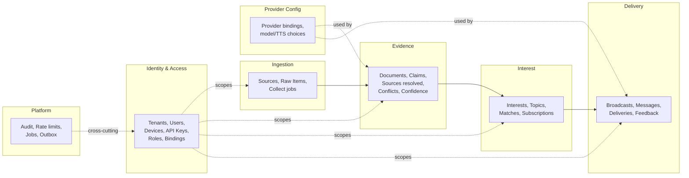

# 02 — DDD Boundaries & Domain Model

Deliverables **4 (DDD boundaries)** and **5 (Domain Model)**.

All statements are **[ASSUMED design]** unless marked otherwise — this is the
proposed model for review, not an implemented one.

---

## 1. Bounded contexts

Each context owns its data and exposes contracts; contexts never reach into
each other's tables. Alignment with the layered target from the brief is noted.

| Context | Owns | Maps to brief layer |
|---------|------|---------------------|
| Identity & Access | tenant/user/device/key/role/channel-binding | Identity Layer |
| Ingestion | sources, raw collected items, collect scheduling | Collect stage |
| Evidence | normalized docs, claims, resolved sources, conflicts, confidence | Evidence Intelligence Engine |
| Interest | user interests, topic catalog, interest→evidence matches | Interest Catalog Engine |
| Delivery | broadcasts, per-recipient messages, feedback | Broadcast Engine + Channel Adapters |
| Provider Config | per-tenant/user provider + key selection | Provider Layer |
| Platform | audit, rate-limit state, job/outbox records | cross-cutting |

**Context-mapping patterns [ASSUMED]:** Ingestion→Evidence→Interest→Delivery is
a **pipeline/conformist** flow over the shared envelope contract. Identity is an
**upstream** context every other context conforms to (tenant scoping).

---

## 2. Aggregates & key entities

Each aggregate has a root; all carry `tenant_id`. Where the brief mandates
`user_id`/`device_id`, those are included.

### Identity & Access
- **Tenant** (root): `id`, `name`, `status`, `plan`, `created_at`.
- **User** (root): `id`, `tenant_id`, `email`, `status`, `auth_provider_ref`.
- **Device** (root): `id`, `tenant_id`, `user_id`, `platform` (ios/android),
  `apns_token`, `last_seen_at`.
- **ApiKey** (root): `id`, `tenant_id`, `user_id`, `scopes[]`, `hash`,
  `last_used_at`, `revoked_at`. **[VERIFIED principle]** never global; hashed.
- **Role / RoleBinding**: RBAC assignment scoped to tenant.
- **ChannelBinding** (root): `id`, `tenant_id`, `user_id`, `channel`,
  `external_ref`, `verified`, `credentials_ref`. Links a user to Telegram/
  WhatsApp/WeChat/WeCom/iOS identities.

### Ingestion
- **Source** (root): `id`, `tenant_id`, `type`, `config`, `enabled`.
- **RawItem** (root): `id`, `tenant_id`, `source_id`, `payload_ref`,
  `fetched_at`, `content_hash`.

### Evidence
- **Document** (root): normalized content derived from RawItem(s).
- **Claim** (entity): an extracted assertion with `subject/predicate/object`
  and provenance back to Document(s).
- **ResolvedSource** (entity): canonical source identity a claim traces to.
- **Conflict** (entity): a detected contradiction between claims.
- **ConfidenceScore** (value): per-claim score with method + inputs.

### Interest
- **Interest** (root): `id`, `tenant_id`, `user_id`, `topic`, `weight`,
  `active`.
- **Topic** (root): catalog entry, tenant-scoped.
- **InterestMatch** (entity): links Interest ↔ Evidence with a match score.

### Delivery
- **Broadcast** (root): a fan-out unit derived from matched evidence.
- **Message** (entity): per-recipient rendering (text and/or audio).
- **Delivery** (entity): channel send attempt + status.
- **Feedback** (entity): user reaction/read/complaint feeding back into scoring.

### Provider Config
- **ProviderBinding** (root): `id`, `tenant_id`, `user_id?`, `category`
  (model/tts/…), `provider`, `credentials_ref`, `settings`.

### Platform
- **AuditEvent**, **RateLimitCounter**, **Job**, **OutboxRecord**.

---

## 3. Ubiquitous language (selected)

| Term | Meaning |
|------|---------|
| **Envelope** | The single internal message contract all channels normalize to. |
| **Claim** | A discrete, checkable assertion extracted from a Document. |
| **Confidence** | A score assigned after cross-validation and conflict detection. |
| **Interest match** | Evidence deemed relevant to a user's Interest. |
| **Broadcast** | Delivery of matched, summarized evidence to a user's channels. |
| **Binding** | A verified link between a User and an external channel identity. |

---

## 4. Invariants (must hold, [VERIFIED as principle])

1. Every row is tenant-scoped; no query returns cross-tenant data without an
   explicit, audited elevation.
2. A Claim always traces to at least one Document; a Document to at least one
   RawItem.
3. A Broadcast only targets **verified** ChannelBindings.
4. Provider credentials are never stored inline — only `credentials_ref`.
5. Confidence is only assigned after the Cross-Validate + Detect-Conflicts
   stages have run (no stage skipping).
