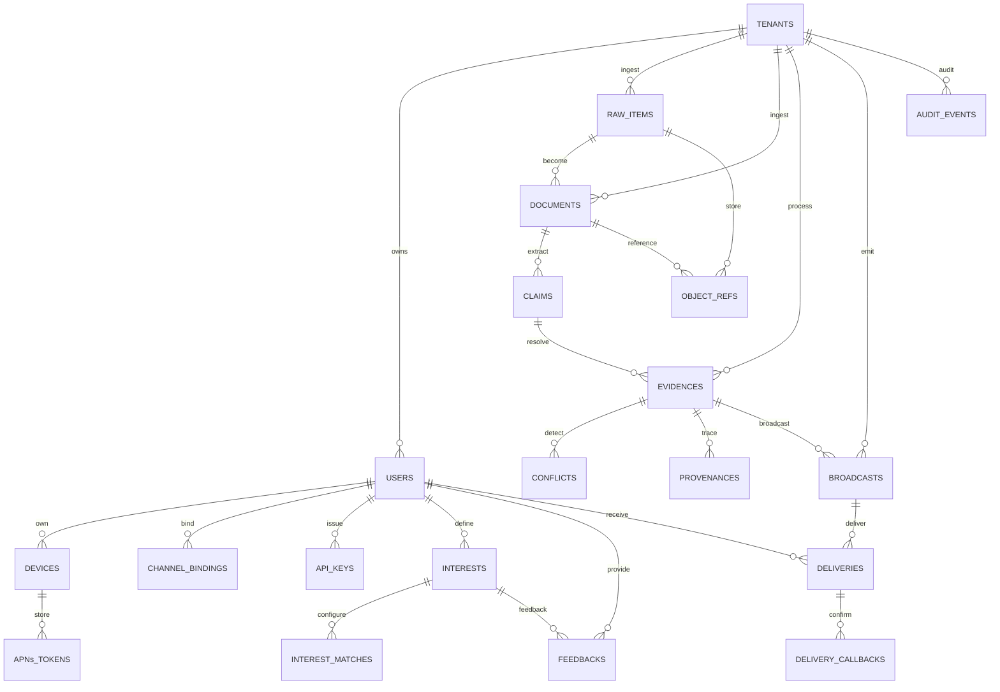

# Deliverable 6: Database ERD & Schema

## Complete ERD (Mermaid)



## Schema (SQL)

### Identity Context

```sql
-- Tenants (root isolation key)
CREATE TABLE tenants (
    id UUID PRIMARY KEY DEFAULT gen_random_uuid(),
    name TEXT NOT NULL,
    plan VARCHAR(50) DEFAULT 'free',
    status VARCHAR(50) DEFAULT 'active',
    created_at TIMESTAMP DEFAULT NOW(),
    updated_at TIMESTAMP DEFAULT NOW(),
    
    CONSTRAINT valid_plan CHECK (plan IN ('free', 'pro', 'enterprise')),
    CONSTRAINT valid_status CHECK (status IN ('active', 'suspended', 'deleted'))
);

-- Row-Level Security policy (see below)
ALTER TABLE tenants ENABLE ROW LEVEL SECURITY;
CREATE POLICY rls_tenants ON tenants USING (id = current_setting('app.tenant_id')::uuid);

-- Users (tenant-scoped)
CREATE TABLE users (
    id UUID PRIMARY KEY DEFAULT gen_random_uuid(),
    tenant_id UUID NOT NULL REFERENCES tenants(id) ON DELETE CASCADE,
    email TEXT NOT NULL,
    email_verified BOOLEAN DEFAULT FALSE,
    roles TEXT[] DEFAULT '{"member"}',
    status VARCHAR(50) DEFAULT 'active',
    last_active_at TIMESTAMP,
    created_at TIMESTAMP DEFAULT NOW(),
    updated_at TIMESTAMP DEFAULT NOW(),
    
    CONSTRAINT unique_email_per_tenant UNIQUE (tenant_id, email),
    CONSTRAINT valid_status CHECK (status IN ('active', 'inactive', 'deleted'))
);
ALTER TABLE users ENABLE ROW LEVEL SECURITY;
CREATE POLICY rls_users ON users USING (tenant_id = current_setting('app.tenant_id')::uuid);

-- Devices (user-scoped, stores APNs token for push notifications)
CREATE TABLE devices (
    id UUID PRIMARY KEY DEFAULT gen_random_uuid(),
    user_id UUID NOT NULL REFERENCES users(id) ON DELETE CASCADE,
    device_id TEXT NOT NULL,
    apns_token TEXT,
    last_active_at TIMESTAMP DEFAULT NOW(),
    created_at TIMESTAMP DEFAULT NOW(),
    updated_at TIMESTAMP DEFAULT NOW(),
    
    CONSTRAINT unique_device_per_user UNIQUE (user_id, device_id)
);
ALTER TABLE devices ENABLE ROW LEVEL SECURITY;
CREATE POLICY rls_devices ON devices USING (
    user_id IN (SELECT id FROM users WHERE tenant_id = current_setting('app.tenant_id')::uuid)
);

-- Channel Bindings (user-scoped, stores handle/ID on external platform)
CREATE TABLE channel_bindings (
    id UUID PRIMARY KEY DEFAULT gen_random_uuid(),
    user_id UUID NOT NULL REFERENCES users(id) ON DELETE CASCADE,
    channel VARCHAR(50) NOT NULL,
    handle TEXT NOT NULL,
    status VARCHAR(50) DEFAULT 'verified',
    verified_at TIMESTAMP,
    created_at TIMESTAMP DEFAULT NOW(),
    
    CONSTRAINT unique_binding_per_user UNIQUE (user_id, channel, handle),
    CONSTRAINT valid_channel CHECK (channel IN ('telegram', 'whatsapp', 'wechat', 'wecom', 'ios'))
);
ALTER TABLE channel_bindings ENABLE ROW LEVEL SECURITY;
CREATE POLICY rls_channel_bindings ON channel_bindings USING (
    user_id IN (SELECT id FROM users WHERE tenant_id = current_setting('app.tenant_id')::uuid)
);

-- API Keys (user-scoped, key itself is hashed)
CREATE TABLE api_keys (
    id UUID PRIMARY KEY DEFAULT gen_random_uuid(),
    user_id UUID NOT NULL REFERENCES users(id) ON DELETE CASCADE,
    key_hash TEXT NOT NULL UNIQUE,
    scopes TEXT[] DEFAULT '{"read"}',
    last_used_at TIMESTAMP,
    rotated_at TIMESTAMP,
    created_at TIMESTAMP DEFAULT NOW(),
    expires_at TIMESTAMP
);
ALTER TABLE api_keys ENABLE ROW LEVEL SECURITY;
CREATE POLICY rls_api_keys ON api_keys USING (
    user_id IN (SELECT id FROM users WHERE tenant_id = current_setting('app.tenant_id')::uuid)
);

-- Audit Events (append-only, tenant-scoped)
CREATE TABLE audit_events (
    id UUID PRIMARY KEY DEFAULT gen_random_uuid(),
    tenant_id UUID NOT NULL REFERENCES tenants(id) ON DELETE CASCADE,
    actor_id UUID REFERENCES users(id) ON DELETE SET NULL,
    action VARCHAR(100) NOT NULL,
    resource_type VARCHAR(100),
    resource_id UUID,
    details JSONB,
    timestamp TIMESTAMP DEFAULT NOW(),
    
    INDEX idx_audit_tenant_ts (tenant_id, timestamp DESC)
);
ALTER TABLE audit_events ENABLE ROW LEVEL SECURITY;
CREATE POLICY rls_audit ON audit_events USING (
    tenant_id = current_setting('app.tenant_id')::uuid
);
```

### Evidence Context

```sql
-- Raw Items (tenant-scoped, first ingest point)
CREATE TABLE raw_items (
    id UUID PRIMARY KEY DEFAULT gen_random_uuid(),
    tenant_id UUID NOT NULL REFERENCES tenants(id) ON DELETE CASCADE,
    channel VARCHAR(50) NOT NULL,
    sender_id UUID REFERENCES users(id) ON DELETE SET NULL,
    sender_handle TEXT,
    text TEXT,
    raw_data JSONB,
    status VARCHAR(50) DEFAULT 'received',
    received_at TIMESTAMP DEFAULT NOW(),
    
    INDEX idx_raw_items_tenant_ts (tenant_id, received_at DESC)
);
ALTER TABLE raw_items ENABLE ROW LEVEL SECURITY;
CREATE POLICY rls_raw_items ON raw_items USING (
    tenant_id = current_setting('app.tenant_id')::uuid
);

-- Documents (normalized, indexed)
CREATE TABLE documents (
    id UUID PRIMARY KEY DEFAULT gen_random_uuid(),
    tenant_id UUID NOT NULL REFERENCES tenants(id) ON DELETE CASCADE,
    raw_item_id UUID REFERENCES raw_items(id) ON DELETE SET NULL,
    title TEXT,
    content TEXT,
    source_url TEXT,
    metadata JSONB,
    indexed_at TIMESTAMP DEFAULT NOW(),
    
    INDEX idx_docs_tenant_url (tenant_id, source_url)
);
ALTER TABLE documents ENABLE ROW LEVEL SECURITY;
CREATE POLICY rls_documents ON documents USING (
    tenant_id = current_setting('app.tenant_id')::uuid
);

-- Claims (extracted facts)
CREATE TABLE claims (
    id UUID PRIMARY KEY DEFAULT gen_random_uuid(),
    document_id UUID NOT NULL REFERENCES documents(id) ON DELETE CASCADE,
    statement TEXT NOT NULL,
    confidence FLOAT DEFAULT 0.5,
    extracted_at TIMESTAMP DEFAULT NOW()
);
ALTER TABLE claims ENABLE ROW LEVEL SECURITY;
CREATE POLICY rls_claims ON claims USING (
    document_id IN (SELECT id FROM documents WHERE tenant_id = current_setting('app.tenant_id')::uuid)
);

-- Evidences (resolved with conflict detection & scoring)
CREATE TABLE evidences (
    id UUID PRIMARY KEY DEFAULT gen_random_uuid(),
    tenant_id UUID NOT NULL REFERENCES tenants(id) ON DELETE CASCADE,
    claim_id UUID NOT NULL REFERENCES claims(id) ON DELETE CASCADE,
    status VARCHAR(50) DEFAULT 'active',
    confidence_score FLOAT DEFAULT 0.5,
    resolved_at TIMESTAMP DEFAULT NOW(),
    summarized_at TIMESTAMP,
    
    INDEX idx_evidences_tenant_status (tenant_id, status)
);
ALTER TABLE evidences ENABLE ROW LEVEL SECURITY;
CREATE POLICY rls_evidences ON evidences USING (
    tenant_id = current_setting('app.tenant_id')::uuid
);

-- Conflicts (bidirectional)
CREATE TABLE conflicts (
    id UUID PRIMARY KEY DEFAULT gen_random_uuid(),
    evidence_a_id UUID NOT NULL REFERENCES evidences(id) ON DELETE CASCADE,
    evidence_b_id UUID NOT NULL REFERENCES evidences(id) ON DELETE CASCADE,
    severity VARCHAR(50) DEFAULT 'medium',
    detected_at TIMESTAMP DEFAULT NOW(),
    
    CONSTRAINT valid_severity CHECK (severity IN ('low', 'medium', 'high'))
);

-- Provenances (lineage: evidence → documents → raw_items)
CREATE TABLE provenances (
    id UUID PRIMARY KEY DEFAULT gen_random_uuid(),
    evidence_id UUID NOT NULL REFERENCES evidences(id) ON DELETE CASCADE,
    document_id UUID NOT NULL REFERENCES documents(id) ON DELETE CASCADE,
    raw_item_id UUID NOT NULL REFERENCES raw_items(id) ON DELETE CASCADE
);
```

### Interest Context

```sql
-- Interests (user-scoped topics)
CREATE TABLE interests (
    id UUID PRIMARY KEY DEFAULT gen_random_uuid(),
    user_id UUID NOT NULL REFERENCES users(id) ON DELETE CASCADE,
    topic TEXT NOT NULL,
    description TEXT,
    created_at TIMESTAMP DEFAULT NOW(),
    
    CONSTRAINT unique_interest_per_user UNIQUE (user_id, topic)
);
ALTER TABLE interests ENABLE ROW LEVEL SECURITY;
CREATE POLICY rls_interests ON interests USING (
    user_id IN (SELECT id FROM users WHERE tenant_id = current_setting('app.tenant_id')::uuid)
);

-- Interest Matches (how to determine if evidence matches this interest)
CREATE TABLE interest_matches (
    id UUID PRIMARY KEY DEFAULT gen_random_uuid(),
    interest_id UUID NOT NULL REFERENCES interests(id) ON DELETE CASCADE,
    rule_type VARCHAR(50) NOT NULL,
    rule_config JSONB NOT NULL,
    active BOOLEAN DEFAULT TRUE,
    created_at TIMESTAMP DEFAULT NOW(),
    
    CONSTRAINT valid_rule_type CHECK (rule_type IN ('keyword', 'nlp', 'ml_model', 'manual'))
);

-- Feedbacks (user indicates relevance for training)
CREATE TABLE feedbacks (
    id UUID PRIMARY KEY DEFAULT gen_random_uuid(),
    user_id UUID NOT NULL REFERENCES users(id) ON DELETE CASCADE,
    evidence_id UUID NOT NULL REFERENCES evidences(id) ON DELETE CASCADE,
    is_relevant BOOLEAN NOT NULL,
    timestamp TIMESTAMP DEFAULT NOW(),
    
    CONSTRAINT unique_feedback_per_user_evidence UNIQUE (user_id, evidence_id)
);
```

### Broadcast Context

```sql
-- Broadcasts (delivery plan for an evidence)
CREATE TABLE broadcasts (
    id UUID PRIMARY KEY DEFAULT gen_random_uuid(),
    tenant_id UUID NOT NULL REFERENCES tenants(id) ON DELETE CASCADE,
    evidence_id UUID NOT NULL REFERENCES evidences(id) ON DELETE CASCADE,
    created_at TIMESTAMP DEFAULT NOW(),
    
    INDEX idx_broadcasts_tenant_ts (tenant_id, created_at DESC)
);
ALTER TABLE broadcasts ENABLE ROW LEVEL SECURITY;
CREATE POLICY rls_broadcasts ON broadcasts USING (
    tenant_id = current_setting('app.tenant_id')::uuid
);

-- Deliveries (one per user × channel)
CREATE TABLE deliveries (
    id UUID PRIMARY KEY DEFAULT gen_random_uuid(),
    broadcast_id UUID NOT NULL REFERENCES broadcasts(id) ON DELETE CASCADE,
    user_id UUID NOT NULL REFERENCES users(id) ON DELETE CASCADE,
    channel VARCHAR(50) NOT NULL,
    status VARCHAR(50) DEFAULT 'pending',
    dedup_key TEXT NOT NULL,
    attempted_at TIMESTAMP,
    delivered_at TIMESTAMP,
    failed_at TIMESTAMP,
    error_message TEXT,
    retry_count INT DEFAULT 0,
    created_at TIMESTAMP DEFAULT NOW(),
    
    CONSTRAINT unique_delivery_dedup UNIQUE (dedup_key),
    CONSTRAINT valid_status CHECK (status IN ('pending', 'sent', 'failed', 'retrying', 'exhausted', 'blocked')),
    INDEX idx_deliveries_status (status),
    INDEX idx_deliveries_user_channel (user_id, channel)
);
ALTER TABLE deliveries ENABLE ROW LEVEL SECURITY;
CREATE POLICY rls_deliveries ON deliveries USING (
    broadcast_id IN (SELECT id FROM broadcasts WHERE tenant_id = current_setting('app.tenant_id')::uuid)
);

-- Delivery Callbacks (webhook confirmations from platforms)
CREATE TABLE delivery_callbacks (
    id UUID PRIMARY KEY DEFAULT gen_random_uuid(),
    delivery_id UUID NOT NULL REFERENCES deliveries(id) ON DELETE CASCADE,
    source_delivery_id TEXT,
    callback_type VARCHAR(50),
    data JSONB,
    received_at TIMESTAMP DEFAULT NOW(),
    
    CONSTRAINT valid_callback_type CHECK (callback_type IN ('delivered', 'read', 'failed', 'bounced'))
);
```

### Infrastructure

```sql
-- Object References (MinIO keys for documents, media)
CREATE TABLE object_refs (
    id UUID PRIMARY KEY DEFAULT gen_random_uuid(),
    tenant_id UUID NOT NULL REFERENCES tenants(id) ON DELETE CASCADE,
    document_id UUID REFERENCES documents(id) ON DELETE CASCADE,
    raw_item_id UUID REFERENCES raw_items(id) ON DELETE CASCADE,
    object_key TEXT NOT NULL,
    content_type TEXT,
    size_bytes INT,
    created_at TIMESTAMP DEFAULT NOW(),
    
    CONSTRAINT unique_object_key UNIQUE (tenant_id, object_key),
    INDEX idx_object_refs_tenant (tenant_id)
);
ALTER TABLE object_refs ENABLE ROW LEVEL SECURITY;
CREATE POLICY rls_object_refs ON object_refs USING (
    tenant_id = current_setting('app.tenant_id')::uuid
);
```

## Key Design Decisions

1. **Multi-Tenancy via RLS** — Every table has `tenant_id` or inherits via FK; RLS policies enforce isolation at the database level.
2. **Dedup in Broadcast** — `dedup_key = hash(broadcast_id, user_id, channel)` prevents duplicate deliveries.
3. **Immutable Audit** — Audit events are append-only; no updates or deletes.
4. **Soft Deletes** — User/Tenant `status` tracks deletion; physical deletion via CASCADE only for child records.
5. **Indexes on Common Filters** — `(tenant_id, timestamp)`, `(status)`, `(user_id, channel)` for performance.
