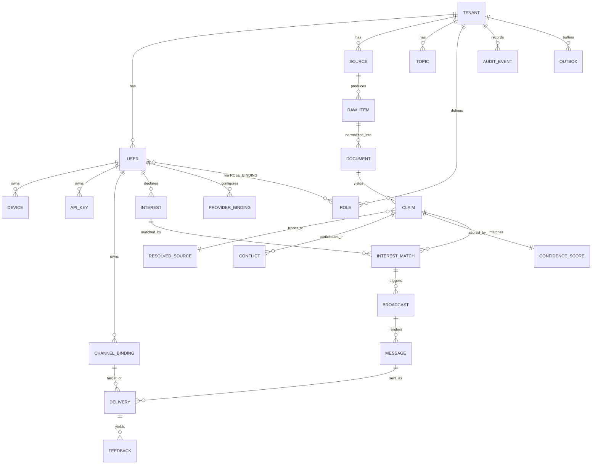

# 03 — Database Entity Relationship

Deliverable **6**. Target engine: **PostgreSQL 16 [VERIFIED]**. Multi-tenant
isolation via **Row-Level Security (RLS) [ASSUMED strategy — ADR-0005]**. This
is a conceptual ERD for review; **no tables are created** (Milestone 0 rule
still in force).

---

## 1. ERD (core)

## 2. Table sketch (columns abbreviated)

> Every table below has `tenant_id uuid NOT NULL` and an RLS policy keyed on the
> session's `app.tenant_id`. Timestamps `created_at/updated_at` implied.

| Table | Key columns | Notes |
|-------|-------------|-------|
| `tenants` | `id`, `name`, `status`, `plan` | root of isolation |
| `users` | `id`, `tenant_id`, `email`, `status`, `auth_ref` | unique `(tenant_id,email)` |
| `devices` | `id`, `tenant_id`, `user_id`, `platform`, `apns_token` | push targets |
| `api_keys` | `id`, `tenant_id`, `user_id`, `hash`, `scopes[]`, `revoked_at` | **hash only** |
| `roles` | `id`, `tenant_id`, `name`, `permissions[]` | RBAC |
| `role_bindings` | `id`, `tenant_id`, `user_id`, `role_id` | |
| `channel_bindings` | `id`, `tenant_id`, `user_id`, `channel`, `external_ref`, `verified`, `credentials_ref` | unique `(tenant_id,channel,external_ref)` |
| `provider_bindings` | `id`, `tenant_id`, `user_id?`, `category`, `provider`, `credentials_ref`, `settings` | per-user provider choice |
| `sources` | `id`, `tenant_id`, `type`, `config`, `enabled` | |
| `raw_items` | `id`, `tenant_id`, `source_id`, `payload_ref`, `content_hash` | dedup key `content_hash` |
| `documents` | `id`, `tenant_id`, `raw_item_id`, `normalized_ref`, `lang` | |
| `claims` | `id`, `tenant_id`, `document_id`, `subject`, `predicate`, `object`, `resolved_source_id` | |
| `resolved_sources` | `id`, `tenant_id`, `canonical_ref`, `trust_prior` | |
| `conflicts` | `id`, `tenant_id`, `claim_a`, `claim_b`, `kind` | |
| `confidence_scores` | `id`, `tenant_id`, `claim_id`, `score`, `method`, `inputs` | 1:1 with claim |
| `interests` | `id`, `tenant_id`, `user_id`, `topic`, `weight`, `active` | |
| `topics` | `id`, `tenant_id`, `key`, `label` | |
| `interest_matches` | `id`, `tenant_id`, `interest_id`, `claim_id`, `score` | |
| `broadcasts` | `id`, `tenant_id`, `status`, `audience_ref` | |
| `messages` | `id`, `tenant_id`, `broadcast_id`, `user_id`, `text_ref`, `audio_ref?` | audio optional |
| `deliveries` | `id`, `tenant_id`, `message_id`, `channel_binding_id`, `channel`, `status`, `attempts` | |
| `feedback` | `id`, `tenant_id`, `delivery_id`, `kind`, `value` | feeds scoring |
| `audit_events` | `id`, `tenant_id`, `actor`, `action`, `target`, `prev_hash` | append-only |
| `outbox` | `id`, `tenant_id`, `aggregate`, `event`, `payload`, `published_at?` | transactional outbox |
| `jobs` | `id`, `tenant_id`, `type`, `state`, `run_at`, `attempts` | scheduler/retry |

## 3. Key data-model decisions

- **[ASSUMED — ADR-0005]** RLS-based shared-schema multi-tenancy (one set of
  tables, `tenant_id` + RLS) rather than schema-per-tenant or DB-per-tenant.
  Rationale: thousands of small tenants on one VPS; per-schema/DB would not
  scale operationally. Revisit for large/regulated tenants (see V8).
- **[VERIFIED principle]** Large blobs (raw payloads, normalized docs, audio)
  live in **object storage**; tables hold `*_ref` pointers, not bytes.
- **[ASSUMED]** `content_hash` on `raw_items` powers the Deduplicate stage at
  the DB level (unique or indexed per tenant+source).
- **[ASSUMED]** Transactional **outbox** table guarantees that domain events
  reach the queue exactly once relative to DB commits.
- **[ASSUMED]** `confidence_scores` is 1:1 with `claims` and only written after
  cross-validation — enforced in the pipeline, not by a DB trigger.

## 4. Indexing & partitioning (initial)

- **[ASSUMED]** Composite indexes lead with `tenant_id` on every hot query path.
- **[ASSUMED]** High-volume, time-series-like tables (`raw_items`, `documents`,
  `deliveries`, `audit_events`) are candidates for monthly range partitioning
  once volume is verified (V7). Not partitioned at launch.
