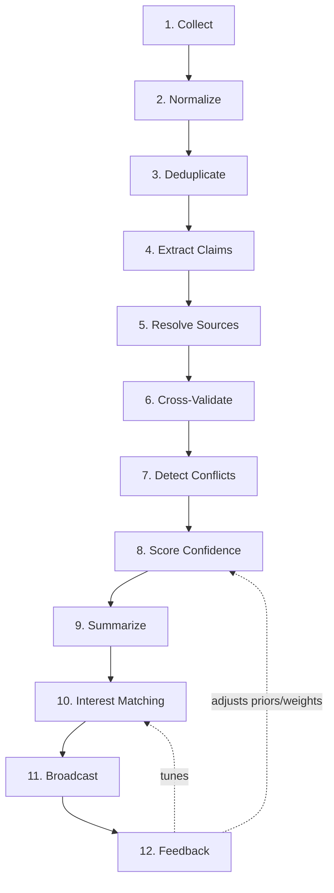

# 04 — Evidence Intelligence Pipeline

Deliverable **7**. The canonical 12-stage pipeline. **No stage may be skipped**
(**[VERIFIED]** mandate). Each stage is an independent, replaceable step running
on workers, communicating via queues and the shared envelope/document contracts.

---

## 1. Stage flow



## 2. Stage contract

**[ASSUMED design]** Every stage implements the same interface so stages are
uniform, testable, and reorder-proof:

```
Stage:
  name: str
  input_contract:  <typed>
  output_contract: <typed>
  run(ctx: TenantContext, input) -> output   # pure w.r.t. providers via ports
  idempotency_key(input) -> str              # safe re-processing
```

- Stages are **pure of transport**: they call providers via interfaces
  (Model/Search/Embedding/…), never a channel directly.
- Stages are **idempotent**: re-running with the same input yields the same
  effect (keyed writes), so retries are safe.
- Stage transitions are queue hops (see [queues](./05-queues-and-workers.md)),
  so any stage can scale independently.

## 3. Stage-by-stage

| # | Stage | Input → Output | Providers used | Notes |
|---|-------|----------------|----------------|-------|
| 1 | **Collect** | Source config → RawItem | Search/HTTP fetch | Scheduled + on-demand. Stores payload to object storage. **[ASSUMED]** source types TBD (V-items). |
| 2 | **Normalize** | RawItem → Document | (none / parser) | Canonical text + metadata; language detect. |
| 3 | **Deduplicate** | Document → Document\|drop | Embedding (near-dup) | Exact via `content_hash`; near-dup via vector similarity. **[ASSUMED]** threshold configurable. |
| 4 | **Extract Claims** | Document → Claim[] | Model (LLM) | Structured claim extraction. **Prompt-injection isolation applies** (content is data, not instructions). |
| 5 | **Resolve Sources** | Claim → Claim+ResolvedSource | Search/Model | Canonicalize the origin/source of each claim. |
| 6 | **Cross-Validate** | Claim[] → corroboration set | Search/Embedding/Model | Find supporting/contradicting evidence across sources. |
| 7 | **Detect Conflicts** | Claim[] → Conflict[] | Model | Flag contradictions between claims. |
| 8 | **Score Confidence** | Claim(+context) → ConfidenceScore | Model/heuristics | Combine corroboration, source trust priors, conflicts. Only runs after 6+7. |
| 9 | **Summarize** | scored Claims → Summary | Model | Human-readable, per-audience summary; cite claims. |
| 10 | **Interest Matching** | Summary/Claims × Interests → InterestMatch[] | Embedding/Model | Match to each user's interests, tenant-scoped. |
| 11 | **Broadcast** | InterestMatch → Message/Delivery | TTS (optional), Channel adapters | Render text/audio; fan-out via ChannelAdapter. Rate-limited. |
| 12 | **Feedback** | Delivery reactions → Feedback | (none) | Read/react/complaint signals loop back to scoring + matching weights. |

## 4. Cross-cutting pipeline concerns

- **[VERIFIED]** Tenant context flows through every stage; no cross-tenant mixing.
- **[VERIFIED]** LLM stages (4,6,7,8,9,10) treat inbound content as untrusted;
  tool/permission boundaries per [SECURITY.md](../SECURITY.md).
- **[ASSUMED]** Each stage emits a domain event via the outbox for
  observability and for the Feedback loop.
- **[ASSUMED]** Provenance is preserved end-to-end: Summary → Claims →
  Documents → RawItems → Source, so any broadcast is explainable/auditable.
- **[ASSUMED]** Backpressure: if a downstream stage lags, its queue depth
  triggers autoscaling or shedding of low-priority tenants (see scaling).

## 5. Failure & retry semantics

- **[ASSUMED]** Per-stage retry with exponential backoff; poison messages go to
  a per-stage dead-letter queue with tenant + stage tags.
- **[ASSUMED]** A stage failure never advances the item; the item stays at its
  current stage until success or DLQ, preserving "no stage skipped."
