# 05 — Queue & Worker Architecture

Deliverables **8 (Queue)** and **9 (Worker)**. Backing store: **Redis 7
[VERIFIED target]**. Queue library choice is **[ASSUMED — ADR-0006]**.

---

## 1. Queue topology

**[ASSUMED]** One durable queue per pipeline stage plus operational queues.
Per-stage queues make each stage independently scalable and observable, and let
retries/DLQ be stage-specific.

```mermaid
flowchart LR
    subgraph "Ingress"
        gw[Gateway] --> qin[(q.inbound)]
        sch[Scheduler] --> qcollect[(q.collect)]
    end

    qcollect --> w1((Collect W))
    w1 --> qnorm[(q.normalize)] --> w2((Normalize W))
    w2 --> qdedup[(q.dedup)] --> w3((Dedup W))
    w3 --> qclaims[(q.extract)] --> w4((Extract W))
    w4 --> qresolve[(q.resolve)] --> w5((Resolve W))
    w5 --> qxval[(q.crossval)] --> w6((CrossVal W))
    w6 --> qconf[(q.conflict)] --> w7((Conflict W))
    w7 --> qscore[(q.score)] --> w8((Score W))
    w8 --> qsum[(q.summarize)] --> w9((Summarize W))
    w9 --> qmatch[(q.match)] --> w10((Match W))
    w10 --> qbroad[(q.broadcast)] --> w11((Broadcast W))
    w11 --> qtts[(q.tts)] --> wtts((TTS W))
    qin --> w2
    w11 --> qsend[(q.send)] --> wsend((Send/Adapter W))
    wsend --> qfb[(q.feedback)] --> w12((Feedback W))

    classDef dlq fill:#fdd;
```



Plus cross-cutting queues:

| Queue | Purpose |
|-------|---------|
| `q.inbound` | Normalized inbound channel events from the Gateway. |
| `q.collect` | Scheduled/on-demand collection jobs. |
| `q.tts` | Text-to-speech synthesis jobs (separate: slow, provider-bound). |
| `q.send` | Outbound channel send jobs (rate-limited per channel/tenant). |
| `q.feedback` | Inbound reactions/read receipts to close the loop. |
| `q.<stage>.dlq` | Per-stage dead-letter queue for poison messages. |

## 2. Message envelope on the queue

**[ASSUMED]** Every queue message carries:

```
{
  msg_id, idempotency_key,
  tenant_id, user_id?, device_id?,     # isolation keys — always present
  stage, attempt, enqueued_at,
  payload_ref | payload,               # pointer to object storage or inline
  trace_id                             # for distributed tracing
}
```

- **[VERIFIED principle]** `tenant_id` is mandatory on every message; workers
  set the DB tenant context from it before any query.
- **[ASSUMED]** Large payloads are passed by `payload_ref` (object storage), not
  inline, to keep Redis small.

## 3. Worker model

| Aspect | Decision | Marker |
|--------|----------|--------|
| Concurrency | One worker deployment per stage class; N processes each. | [ASSUMED] |
| Scaling unit | Scale a stage by adding worker replicas consuming its queue. | [VERIFIED principle: modular/replaceable] |
| Priority | Per-tenant fair-share; low-priority tenants shed first under load. | [ASSUMED] |
| Idempotency | `idempotency_key` + keyed writes make re-delivery safe. | [ASSUMED] |
| Retry | Exponential backoff, max attempts, then DLQ. | [ASSUMED] |
| Poison handling | DLQ per stage with alerting; manual/automated replay. | [ASSUMED] |
| Isolation | Worker loads tenant context from message; RLS enforces at DB. | [VERIFIED principle] |
| Rate limiting | `q.send` and provider calls honor per-tenant/key Redis counters. | [VERIFIED principle] |

## 4. Delivery guarantees

- **[ASSUMED]** **At-least-once** processing with idempotent stages → effectively
  once. Chosen over exactly-once (which Redis alone cannot guarantee cheaply).
- **[ASSUMED]** Transactional **outbox** in Postgres → a relay publishes to
  Redis, so DB writes and queue publishes cannot diverge on crash.

## 5. Why separate TTS and Send queues

**[ASSUMED]** TTS is slow and provider-metered; outbound send is rate-limited by
each channel's API. Isolating them prevents a slow TTS provider or a throttled
WhatsApp number from stalling the analytical pipeline stages.

## 6. Queue-library candidates (to decide in ADR-0006)

- **[ASSUMED]** Options: Celery (mature, Redis broker), RQ (simple), Dramatiq,
  or Arq (async-native, pairs well with FastAPI). Recommendation leans **Arq or
  Celery** pending V7 volume; not decided here.
