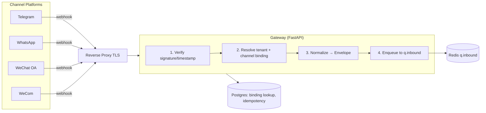
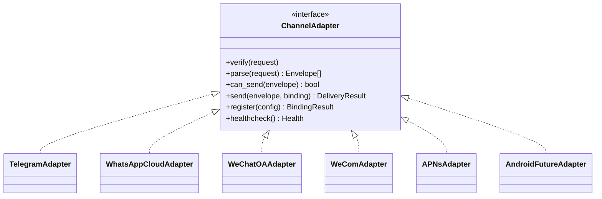

# 06 — Gateway & Channel Adapter Architecture

Deliverables **10 (Gateway)** and **13 (Channel Adapter)**.

Core rule (**[VERIFIED]** mandate): **every** communication platform implements
**exactly one** `ChannelAdapter` interface, and **no business logic lives in an
adapter** — adapters are transport-only.

---

## 1. Gateway architecture

The Gateway is the inbound edge (FastAPI). It does four things and nothing else:



| Step | Responsibility | Marker |
|------|----------------|--------|
| 1 Verify | Validate each platform's webhook signature/timestamp; reject replays. | [VERIFIED principle] |
| 2 Resolve | Map the inbound external identity to `(tenant_id, user_id, binding)`. | [VERIFIED principle] |
| 3 Normalize | Convert platform payload → internal **Envelope** (one shape). | [VERIFIED principle] |
| 4 Enqueue | Put the Envelope on `q.inbound`; return the platform's required ack. | [ASSUMED] |

**Gateway does NOT**: extract claims, call models, decide broadcasts, or store
business entities. It only produces Envelopes. **[VERIFIED principle]**

### Inbound idempotency
**[ASSUMED]** Each platform's message id + tenant forms an idempotency key so
retried webhooks don't double-enqueue.

---

## 2. The single ChannelAdapter interface

**[ASSUMED design]** One interface, implemented identically by every channel:

```
interface ChannelAdapter:
    channel: ChannelId

    # inbound (used by Gateway)
    verify(request) -> VerifiedRequest        # signature/timestamp check
    parse(request)  -> Envelope[]             # platform payload -> envelope(s)

    # outbound (used by Send worker)
    can_send(envelope) -> bool                # capability check (text/audio/template)
    send(envelope, binding) -> DeliveryResult # transport only

    # lifecycle
    register(binding_config) -> BindingResult # bind a user to this channel
    healthcheck() -> Health
```

**Rules enforced by the interface [VERIFIED principle]:**
- Same signature for Telegram, WhatsApp, WeChat OA, WeCom, APNs, future Android.
- Adapters translate to/from the Envelope and call the platform API. They hold
  **no** interest logic, no scoring, no summarization.
- Capability differences (e.g. WhatsApp template messages, voice notes) are
  expressed through `can_send`/capability flags, not by branching business code.



## 3. Per-channel specifics (all [ASSUMED — require verification])

| Channel | Inbound | Outbound | Verify item |
|---------|---------|----------|-------------|
| Telegram | Bot API webhook | Bot API sendMessage/sendVoice | bot token per tenant binding |
| WhatsApp Cloud API | Meta webhook | Cloud API messages (session + templates) | V3 tier/limits, template approval |
| WeChat Official Account | WeChat callback | customer-service/template msgs | V4 account type (subscription vs service) |
| Enterprise WeChat (WeCom) | WeCom callback | app message push | V5 app provisioning + agentid |
| APNs (iOS) | — (outbound only) | HTTP/2 token-based push | V6 token vs cert, key id/team id |
| Android (future) | — | FCM | not in v1.0 scope |

**[VERIFIED]** APNs is outbound-only; the others are bidirectional.

## 4. Envelope (recap)

The Envelope contract is owned by `packages/contracts` and defined conceptually
in [schemas/envelope](../../schemas/envelope/README.md). Every adapter and every
pipeline stage depends only on it — this is the stable seam that keeps channels
swappable.

## 5. Why Gateway ≠ Adapters as one thing

**[ASSUMED]** The Gateway orchestrates verify→resolve→normalize→enqueue and is a
running service; ChannelAdapters are libraries the Gateway (inbound) and Send
worker (outbound) call. Same adapter code, two call sites. This avoids
duplicating platform logic across ingress and egress.
