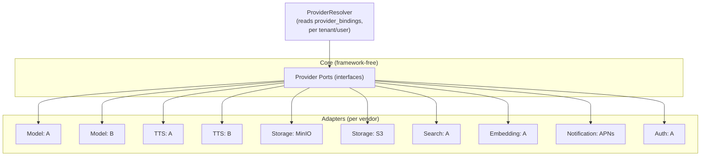
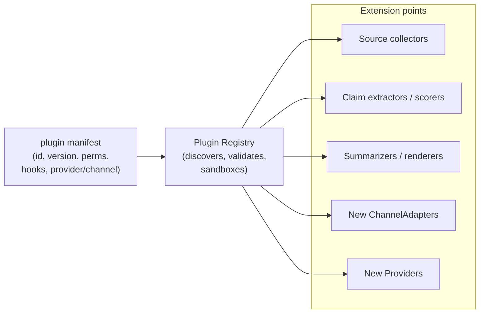

# 07 — Provider & Plugin Architecture

Deliverables **11 (Provider)** and **12 (Plugin)**.

Core rule (**[VERIFIED]** mandate): **every external service is abstracted**
behind a provider interface, with **no provider-specific business logic** in the
core.

---

## 1. Provider architecture

Seven provider categories, each a stable interface with swappable
implementations, selected **per tenant/user** via `provider_bindings`.

| Provider | Interface (abbrev.) | Examples **[ASSUMED]** | Selected by |
|----------|--------------------|------------------------|-------------|
| **ModelProvider** | `complete()`, `chat()`, `tools()` | multiple LLM vendors | tenant/user binding |
| **TTSProvider** | `synthesize(text, voice) -> audio_ref` | multiple TTS vendors | tenant/user binding |
| **StorageProvider** | `put/get/presign` | MinIO, S3 | tenant/global |
| **SearchProvider** | `search(query) -> results` | web/search APIs | tenant/user |
| **EmbeddingProvider** | `embed(texts) -> vectors` | embedding vendors | tenant/user |
| **NotificationProvider** | `push(device, payload)` | APNs (+ FCM future) | platform |
| **AuthenticationProvider** | `authenticate()`, `verify_token()` | OIDC/email/passkey | tenant/global |

### Provider rules
- **[VERIFIED principle]** Core calls only the interface; it never imports a
  vendor SDK directly. Vendor SDKs live only in that provider's adapter.
- **[VERIFIED principle]** No business logic in a provider adapter — it maps
  the interface to the vendor API and back, nothing more.
- **[VERIFIED principle]** Credentials come from `credentials_ref` →
  secrets manager, never inline; **never shared across tenants**.
- **[ASSUMED]** A `ProviderResolver` picks the concrete implementation at
  runtime from `provider_bindings` for the active tenant/user, with a safe
  platform default when a user has not chosen one.
- **[ASSUMED]** Cost/rate metering wraps every provider call (per tenant/key).

### Failure & fallback
- **[ASSUMED]** Providers are called through a resilience wrapper (timeout,
  retry, circuit-breaker). Optional per-category fallback ordering
  (e.g. model A → model B) is configuration, not code branches in the core.

---

## 2. Plugin architecture

Plugins extend EIOS **without forking core** and **without modifying OpenClaw**.
They are the sanctioned extension mechanism.

| Aspect | Decision | Marker |
|--------|----------|--------|
| Extension points | collectors, pipeline-stage strategies, summarizer/renderers, channel adapters, providers. | [ASSUMED] |
| Manifest | declares id, version, requested **permissions**, and which hooks it implements. | [ASSUMED] |
| Isolation | plugins run within explicit **tool/permission boundaries**; they cannot escalate or read other tenants. | [VERIFIED principle] |
| Trust tiers | first-party (in-repo `plugins/`) vs third-party (reviewed, capability-limited). | [ASSUMED] |
| Versioning | plugins target a versioned Plugin SDK / contract; breaking changes bump SDK major. | [ASSUMED] |
| Loading | discovered at startup from a registry; enable/disable per tenant. | [ASSUMED] |

### Why a plugin system at all
**[ASSUMED]** The brief demands modular, replaceable subsystems and "extend
OpenClaw, never fork." A plugin SDK gives a supported way to add sources,
channels, providers, and scoring strategies without patching core services or
upstream — the same discipline the provider/channel interfaces enforce, opened
up to first- and third-party extensions.

### Relationship to providers & channels
- A new vendor = a **Provider plugin** implementing an existing provider port.
- A new platform = a **Channel plugin** implementing the one `ChannelAdapter`.
- Neither requires touching core or OpenClaw. **[VERIFIED principle]**
