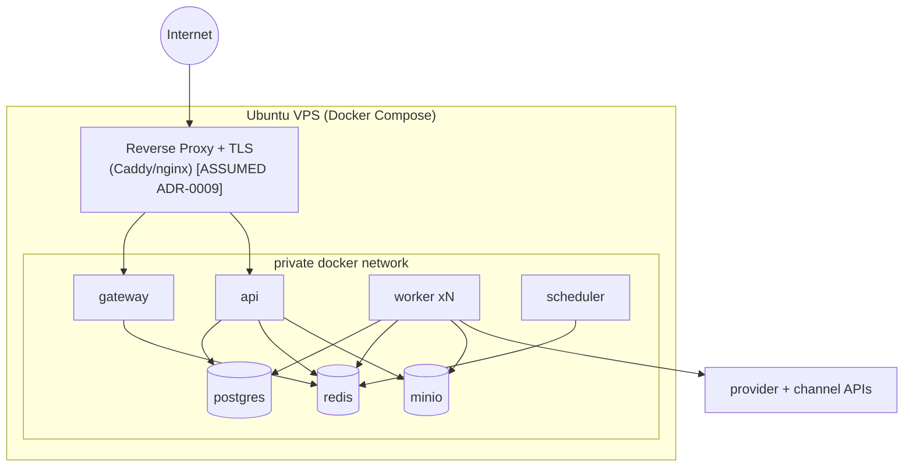

# 09 — Deployment Topology, Docker Compose & Scaling

Deliverables **17 (Deployment topology)**, **18 (Docker Compose topology)**, and
**19 (Scaling roadmap)**.

---

## 17. Deployment topology

**[VERIFIED target]** Single Ubuntu VPS at launch, Docker Compose.

Principles `[VERIFIED/ASSUMED as noted]`:
- **[ASSUMED]** Only the reverse proxy is internet-exposed; everything else is on
  a private Docker network.
- **[VERIFIED principle]** App tiers (`gateway`, `api`, `worker`, `scheduler`)
  are **stateless**; state lives only in `postgres`/`redis`/`minio`.
- **[ASSUMED]** `scheduler` is single-leader to avoid duplicate periodic jobs.
- **[VERIFIED principle]** Secrets injected via environment/secret files; never
  baked into images.
- **[ASSUMED]** Images are pinned by digest for reproducible deploys/DR.

## 18. Docker Compose topology

Two files:
- `deployments/docker-compose.dev.yml` — **exists (Milestone 0)**; backing
  services + commented app placeholders.
- `deployments/docker-compose.prod.yml` — **new (to be authored on approval)**.

Production service set:

| Service | Image basis | Scale | Volume |
|---------|-------------|-------|--------|
| `proxy` | Caddy/nginx | 1 | config |
| `gateway` | app (Python) | replicas | — |
| `api` | app (Python) | replicas | — |
| `worker` | app (Python) | `deploy.replicas` per stage class | — |
| `scheduler` | app (Python) | 1 (leader) | — |
| `postgres` | postgres:16 | 1 (S0) | `postgres_data` |
| `redis` | redis:7 | 1 | `redis_data` |
| `minio` | minio | 1 (S0) | `minio_data` |

Rules `[ASSUMED]`:
- Healthchecks on every service; `depends_on` with condition where supported.
- Resource limits per service (calibrated after **V7** sizing).
- `.env` templates under `deployments/env/`; **no secrets in git**.
- **Directus and n8n are NOT in the production compose** (out of scope; not
  implemented). `[VERIFIED constraint]`

## 19. Scaling roadmap

| Phase | Trigger | Action |
|-------|---------|--------|
| **S0 launch** | 1 VPS | All-in-one Compose; a few worker replicas. |
| **S1** | sustained queue depth / CPU | Scale worker replicas on hot stages; isolate TTS + send workers. |
| **S2** | DB contention | Larger/managed Postgres; read replicas for history reads. |
| **S3** | media growth | External S3-compatible storage instead of local MinIO. |
| **S4** | single-host limits | Split proxy+api / workers / data onto separate hosts; Redis persistence/HA. |
| **S5** | compliance/regional | Region-split data plane (esp. China/WeChat, **V8**). |

Enablers already baked into the design: stateless app tiers, per-stage queues,
provider abstraction, tenant-namespaced storage/cache, and horizontal worker
scaling by queue.
