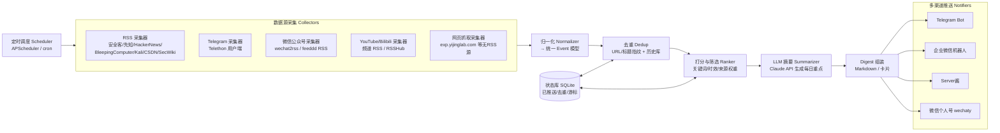

# 安全资讯每日重点聚合与推送系统 — 方案与架构文档

> 目标：自动抓取微信公众号 / Telegram 频道 / 各安全资讯源的更新，每天筛选出「重点事件」，
> 通过 Telegram Bot、企业微信机器人、Server酱、微信个人号推送给你。
>
> 本文档为**第一阶段交付物（方案 + 架构）**，代码实现待本文档确认后再进行。

---

## 1. 需求拆解

| 维度 | 你的要求 | 落地方式 |
|------|----------|----------|
| 来源 | 微信公众号、Telegram 频道/群、外部新闻/RSS、CSDN、SECDaily、先知社区、安全客、CTI Feeds、SecWiki、exp.yijinglab.com、Bleeping Computer、bilibili、YouTube、Kali、The Hacker News | 统一抽象成 **Source（数据源）** + **Collector（采集器）** |
| 频率 | 每日重点 | 定时任务（默认每天 1 次，可配多次） |
| 筛选 | 「重点」事件 | 打分排序 + LLM 摘要 + 去重 |
| 推送 | 企业微信机器人、Server酱、微信个人号、Telegram Bot | 统一抽象成 **Notifier（推送器）**，多渠道并发 |
| 形式 | 「转给我」 | 每日一条结构化 Digest（标题+摘要+原文链接） |

核心思路：**所有来源归一化为统一的 `Event` 数据结构 → 去重 → 打分/筛选 → LLM 生成每日重点摘要 → 多渠道分发。**
采集与推送都做成插件化，新增一个源或一个渠道只需实现一个类。

---

## 2. 整体架构



数据流水线（Pipeline）：
`Collect → Normalize → Dedup → Rank/Filter → Summarize(LLM) → Compose → Notify → Persist`

---

## 3. 数据源接入方案（逐一映射）

不同源接入难度差异很大。**核心原则：能用 RSS 就用 RSS**（稳定、合规、无封号风险），
没有 RSS 的用 RSSHub 路由，再没有才上网页抓取或非官方客户端。

| 来源 | 接入方式 | 说明 / 端点 | 稳定性 |
|------|----------|-------------|--------|
| The Hacker News | RSS | `https://feeds.feedburner.com/TheHackersNews` | 高 |
| Bleeping Computer | RSS | `https://www.bleepingcomputer.com/feed/` | 高 |
| 安全客 anquanke | RSS | `https://api.anquanke.com/data/v1/rss` | 中 |
| 先知社区 xz.aliyun | RSS / RSSHub | `https://xz.aliyun.com/feed`（或 RSSHub 路由） | 中 |
| SecWiki | RSS | `https://www.sec-wiki.com/news/rss` | 中 |
| SECDaily / 安全日报 | RSS / GitHub | 多数以 GitHub 仓库 or RSS 形式发布 | 中 |
| Kali Linux | RSS | `https://www.kali.org/rss.xml` | 高 |
| CSDN | RSS | 博客/专栏 RSS：`https://blog.csdn.net/<user>/rss/list`；App 无公开 API，走 RSSHub | 中 |
| Cyber Threat Intel Feeds | RSS（多个） | 维护一份 CTI feed 清单（CISA、Talos、Unit42 等），批量拉 | 高 |
| YouTube 频道 | RSS | `https://www.youtube.com/feeds/videos.xml?channel_id=<ID>` | 高 |
| Bilibili UP主 | RSSHub | `https://rsshub.app/bilibili/user/dynamic/<uid>` | 中 |
| exp.yijinglab.com | 网页抓取 | 无 RSS，用 httpx + selectolax 解析列表页；失败降级跳过 | 低 |
| Telegram 频道/群 | Telethon（用户端） | 用你自己的账号登录，读频道历史；只读不发言 | 中 |
| 微信公众号 | wechat2rss / feeddd | 自建或第三方把公众号转成 RSS，再按 RSS 处理 | 中 |

> 关于 **RSSHub**：建议**自建一个 RSSHub 实例**（Docker 一键起），把 CSDN App、Bilibili、部分无原生 RSS 的源统一收敛成 RSS，
> 大幅降低维护成本——采集侧只需要写好「RSS 采集器」一个通用实现即可覆盖 80% 的源。

### 3.1 采集器统一接口

```python
class Collector(Protocol):
    source_id: str          # 唯一标识，如 "thehackernews"
    def fetch(self, since: datetime) -> list[RawItem]: ...
```

计划实现的具体采集器：
- `RssCollector`：通用 RSS/Atom，覆盖清单里绝大多数源（feedparser）。
- `TelegramCollector`：Telethon，读取配置的 channel 列表在 `since` 之后的消息。
- `WeChatRssCollector`：本质仍是 RSS，只是来源是 wechat2rss，单独类便于加公众号专属清洗。
- `WebScrapeCollector`：httpx + selectolax，针对 exp.yijinglab.com 这类无 RSS 源，写按站点的解析规则。

---

## 4. 归一化数据模型

所有源产出统一为 `Event`：

```python
@dataclass
class Event:
    id: str            # 稳定指纹：sha1(canonical_url or source_id+title)
    source_id: str     # 来源标识
    source_name: str   # 展示名，如 "The Hacker News"
    title: str
    url: str
    published_at: datetime
    summary_raw: str   # 原文摘要/正文前段
    tags: list[str]    # 采集阶段可打的粗标签（cve/apt/tool/...）
    lang: str          # zh / en
    # 以下由流水线后续阶段填充
    score: float = 0.0
    highlight_summary: str | None = None   # LLM 生成的中文重点摘要
```

---

## 5. 去重、打分与「重点」筛选

### 5.1 去重（Dedup）
- 一级：`canonical_url` 归一化（去 utm 参数、去 fragment）后取指纹。
- 二级：标题做 SimHash / MinHash，跨源同一事件（多家媒体报道同一 CVE）折叠成一条。
- 状态库记录「已见过 / 已推送」的指纹，避免重复推送（SQLite）。

### 5.2 打分（Ranker）—— 决定什么算「重点」
综合评分（可在配置里调权重）：

| 因子 | 说明 |
|------|------|
| 关键词命中 | 命中高价值词加分：`0day / RCE / CVE-高危 / 在野利用 / 供应链 / 勒索 / 数据泄露 / PoC / EXP` |
| 来源权重 | 你信任的源权重更高（如 The Hacker News、安全客置顶） |
| 时效 | 越新分越高（当日 > 昨日残留） |
| 热度 | 跨源出现次数（被多家报道 = 更重要） |
| 交互信号 | Telegram 消息的转发/浏览量、YouTube 播放量（若可得） |

`score = Σ(weight_i × factor_i)`，超过阈值进入候选，Top-N 交给 LLM 精炼。

### 5.3 LLM 摘要（Summarizer）
- 用 **Claude API（`claude-opus-4-8` 或更快的 `claude-haiku-4-5` 做批量摘要）**。
- 对 Top-N 候选：生成 1–2 句中文重点摘要 + 归类（漏洞/威胁情报/工具/教程/行业）。
- 再让模型对整批做一次「今日 TOP 3 最值得关注」的总排序，放在 Digest 顶部。
- 成本控制：只对进入候选的条目调用 LLM，非候选不花 token。

---

## 6. 推送渠道方案（Notifiers）

统一接口，多渠道并发发送，单渠道失败不影响其他：

```python
class Notifier(Protocol):
    channel_id: str
    def send(self, digest: Digest) -> None: ...
```

| 渠道 | 实现方式 | 关键配置 | 备注 |
|------|----------|----------|------|
| **Telegram Bot** | Bot API `sendMessage`（Markdown/HTML） | `BOT_TOKEN`、`CHAT_ID` | 最稳，官方 API，推荐主渠道 |
| **企业微信机器人** | 群机器人 webhook，POST markdown 消息 | `WECOM_WEBHOOK_KEY` | 官方、免登录，适合推给自己的企微 |
| **Server酱** | `https://sctapi.ftqq.com/<KEY>.send` | `SERVERCHAN_KEY` | 转发到个人微信，长文会截断，放摘要+链接 |
| **微信个人号** | wechaty（Docker puppet） | 需扫码登录 | ⚠️ 非官方，**有封号风险**，建议作为可选/备用 |

**推荐组合**：主用 **Telegram Bot + 企业微信机器人**（都稳定官方），
个人微信侧用 **Server酱** 兜底；wechaty 个人号默认关闭，需要时再开。

### 6.1 Digest 呈现
- Telegram / 企业微信：Markdown 卡片
  - 顶部「🔥 今日 TOP 3」
  - 分类列出：漏洞与利用 / 威胁情报 / 工具与项目 / 视频与教程
  - 每条：`标题 — 一句话重点（来源）[原文]`
- Server酱：标题放「安全资讯每日重点 · MM-DD」，正文放精简 Markdown。

---

## 7. 调度与运行

- **调度**：APScheduler（进程内）或系统 cron。默认每天 `09:00` 出一版；可配 `09:00` 早报 + `18:00` 晚报。
- **时间窗**：采集 `[上次成功时间, now]`，用状态库游标保证不漏不重。
- **容错**：单源失败只记日志跳过，不阻断整条流水线；LLM/推送失败重试（指数退避）。
- **可观测**：结构化日志 + 每次运行落一条 run 记录（采集数/去重后/推送数/耗时）。

---

## 8. 技术栈与目录结构

**技术栈**：Python 3.11、httpx、feedparser、Telethon、APScheduler、SQLite（SQLModel/sqlite3）、
selectolax（HTML 解析）、Anthropic SDK（LLM）、pydantic（配置与模型）、Docker（RSSHub / wechaty 可选）。

```
daily-digest/
├── config/
│   ├── config.example.yaml      # 源清单、渠道、权重、调度
│   └── sources.yaml             # 数据源清单（可单独维护）
├── src/digest/
│   ├── models.py                # Event / Digest / RawItem
│   ├── collectors/
│   │   ├── base.py
│   │   ├── rss.py
│   │   ├── telegram.py
│   │   ├── wechat_rss.py
│   │   └── webscrape.py
│   ├── pipeline/
│   │   ├── normalize.py
│   │   ├── dedup.py
│   │   ├── ranker.py
│   │   └── summarizer.py        # Claude API
│   ├── notifiers/
│   │   ├── base.py
│   │   ├── telegram_bot.py
│   │   ├── wecom.py
│   │   ├── serverchan.py
│   │   └── wechaty.py           # 可选
│   ├── store.py                 # SQLite 状态库
│   ├── scheduler.py
│   └── main.py                  # 编排入口：run-once / serve
├── docker/
│   ├── docker-compose.yml       # app + rsshub (+ wechaty 可选)
├── .env.example                 # 各类 token/key
├── pyproject.toml
└── README.md
```

### 8.1 配置示例（草案）

```yaml
schedule:
  cron: "0 9 * * *"           # 每天 9 点
  lookback_hours: 26          # 采集窗口（略大于 24h 防漏）

sources:
  - id: thehackernews
    type: rss
    url: https://feeds.feedburner.com/TheHackersNews
    weight: 1.5
  - id: anquanke
    type: rss
    url: https://api.anquanke.com/data/v1/rss
    weight: 1.3
  - id: tg_secnews
    type: telegram
    channels: ["@some_sec_channel"]
    weight: 1.2
  - id: wx_somegzh
    type: wechat_rss
    url: https://<your-wechat2rss>/feed/xxx.xml
    weight: 1.0
  # ... 其余源同理

ranker:
  keyword_weights:
    "0day": 3
    "在野利用": 3
    "RCE": 2
    "供应链": 2
    "数据泄露": 2
    "PoC": 1
    "EXP": 1
  top_n: 20                   # 进入 LLM 摘要的候选数
  min_score: 2.0

summarizer:
  model: claude-haiku-4-5     # 批量摘要用快模型；TOP3 排序可用 opus
  top_highlights: 3

notifiers:
  telegram_bot:
    enabled: true
  wecom:
    enabled: true
  serverchan:
    enabled: true
  wechaty:
    enabled: false            # 默认关闭，封号风险
```

密钥全部走 `.env` / 环境变量，不入库、不进 git。

---

## 9. 合规与风险提示

| 风险点 | 说明 | 缓解 |
|--------|------|------|
| 微信个人号（wechaty） | 非官方协议，**可能封号** | 默认关闭；优先企业微信机器人 + Server酱 |
| Telegram 用户端（Telethon） | 用个人账号读频道，频率过高可能风控 | 只读、低频、遵守频道规则；也可改用 Bot 加入频道 |
| 网页抓取 | 目标站改版即失效，注意频率与 robots | 低频、设 UA、失败降级跳过 |
| 公众号 RSS 第三方 | 第三方服务可能不稳定 | 优先自建 wechat2rss；多源冗余 |
| 版权 | 只抓标题+摘要+链接，不转载全文 | Digest 仅做导览，正文引导到原文 |

---

## 10. 分阶段落地计划（Roadmap）

- **P0（最小闭环，1 个源 → 1 个渠道）**：`RssCollector`(The Hacker News) → 简单打分 → `TelegramBot` 推送。跑通全链路。
- **P1（多源 + 去重 + LLM 摘要）**：接入全部 RSS 源 + Telegram 采集器；加去重、打分、Claude 摘要；出结构化 Digest。
- **P2（多渠道）**：加企业微信机器人 + Server酱；配置化开关。
- **P3（补齐难源）**：自建 RSSHub 接 CSDN/Bilibili；WebScrape 接 exp.yijinglab.com；wechat2rss 接公众号。
- **P4（可选增强）**：wechaty 个人号、Web 管理面板、历史归档检索、每周汇总。

---

## 11. 待你确认的点

1. **Telegram 采集**用你的个人账号（Telethon，能读私有频道）还是让 Bot 加入频道（更安全但只能读 Bot 所在的公开频道）？
2. **公众号**是否需要我一并给出 **wechat2rss 自建部署**方案，还是你已有 RSS 地址？
3. **LLM** 用 Claude API 可以吗？还是你想用本地/其他模型？会涉及 API Key 与少量成本。
4. 具体的 **Telegram 频道清单、公众号清单、YouTube/Bilibili 频道 ID**，方便我把 `sources.yaml` 直接填好。
5. 每天推送**几次、几点**？（默认每天 09:00 一次）

确认后我进入 **P0/P1** 开始写可运行代码。
